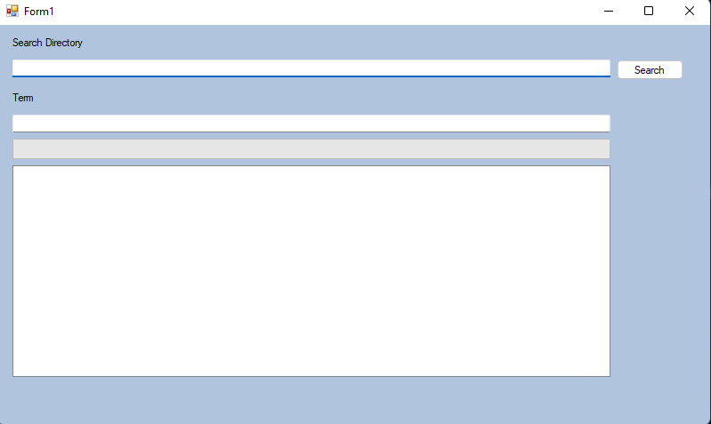
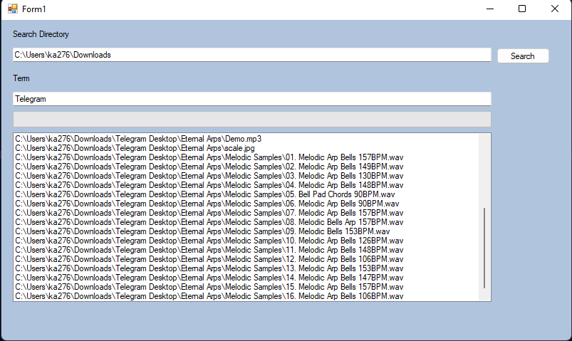

# **C# .NET Folder Searcher**

Welcome to the C#-NET-Folder-Searcher repository! 🚀 This project is a **powerful and efficient folder search utility** built using C# and .NET. It allows users to quickly search for files and folders based on name, extension, with an intuitive user interface.


---

## **📂 Folder Structure**  

```
WinForms-Folder-Searcher/
├── WinForms-Folder-Searcher.sln  # Solution file
├── WinForms-Folder-Searcher/      # Main project folder
│   ├── Forms/                     # UI Forms
│   │   ├── MainForm.cs             # Main UI Form
│   │   ├── MainForm.Designer.cs    # UI layout for MainForm
│   │   ├── SearchResultsForm.cs    # Search results display form
│   │   ├── SearchResultsForm.Designer.cs  

```

---

## **🛠 Features**  

✔ **Fast File & Folder Search** – Quickly scan directories for files and folders.  
✔ **Customizable Filters** – Search by name, extension, size, and date modified.  
✔ **Real-Time Results** – Instant display of matching files as you type.  
✔ **Sorting & Export Options** – Sort search results and export to a file.  

---

## **📌 Technologies Used**  

- **C# (.NET Framework/.NET Core)**  
- **Windows Forms (WinForms)**  

---

## **📖 How to Use**  

### **1️⃣ Clone the Repository**  

```bash
git clone https://github.com/YOUR_USERNAME/CSharp-NET-Folder-Searcher.git
cd CSharp-NET-Folder-Searcher
```
---

## **👨‍💻 Author**  

👤 **Kasam Ali Aftab**  
💼 **Software Engineer**  

Feel free to connect with me for collaboration or feedback!  

---

### 🚀 Happy Coding!  
